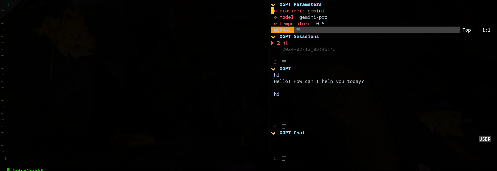
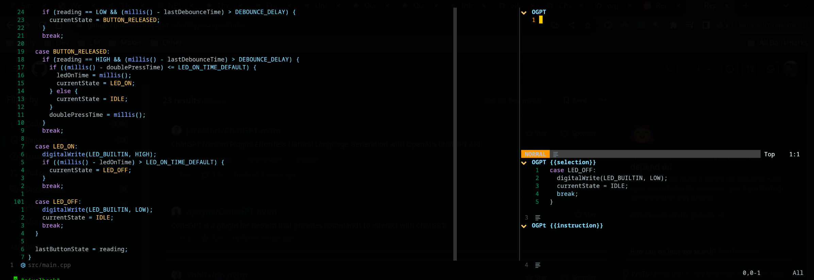
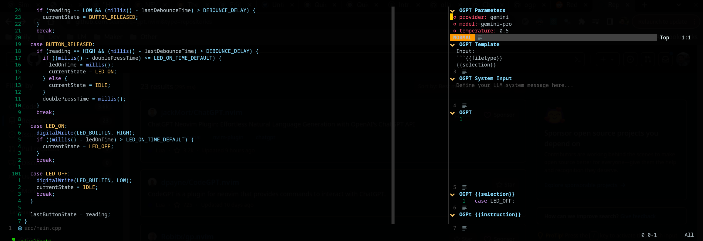
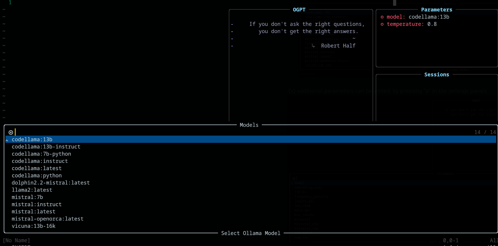
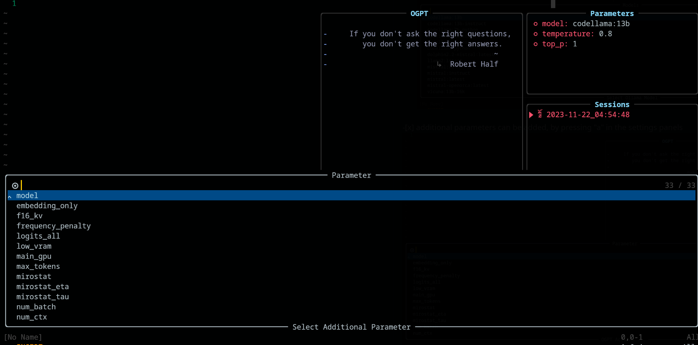

----
# OGPT.nvim


## Features
- **Multiple Providers**: OGPT.nvim can take multiple providers. Ollama, OpenAI, textgenui, Gemini, Anthropic, more if there are pull requests
- **Mix-match Provider**: default provider is used, but you can mix and match different provider AND specific model to different actions, at any point in your run or configurations.
- **Interactive Q&A**: Engage in interactive question-and-answer sessions with LLMs using an intuitive interface.
- **Persona-based Conversations**: Explore various perspectives and have conversations with different personas by selecting prompts from Awesome ChatGPT Prompts.
- **Customizable Actions**: Execute a range of actions utilizing the gpt model, such as grammar
  correction, translation, keyword generation, docstring creation, test addition, code
optimization, summarization, bug fixing, code explanation, and code readability
analysis. Additionally, you can define your own custom actions using a JSON file or just through
plugin configurations.

## Demo
[Screencast from 2024-02-16 15-27-06.webm](https://github.com/huynle/ogpt.nvim/assets/2416122/2c810aee-d282-47c2-86bd-558e39658b0e)


## Installation

If you do not specify a provider, `ollama` will be the default provider. `http://localhost:11434`
is your endpoint. `mistral:7b` will be your default if the configuration is not updated.

```lua
-- Simple, minimal Lazy.nvim configuration
{
  "huynle/ogpt.nvim",
    event = "VeryLazy",
    opts = {
      default_provider = "ollama",
      providers = {
        ollama = {
          api_host = os.getenv("OLLAMA_API_HOST") or "http://localhost:11434",
          api_key = os.getenv("OLLAMA_API_KEY") or "",
        }
      }
    },
    dependencies = {
      "MunifTanjim/nui.nvim",
      "nvim-lua/plenary.nvim",
      "nvim-telescope/telescope.nvim"
    }
}
```

## Configuration

`OGPT.nvim` comes with the following defaults. You can override any of the fields by passing a config as setup parameters.

https://github.com/huynle/ogpt.nvim/blob/main/lua/ogpt/config.lua


### Ollama Setup

`OGPT` is a Neovim plugin that allows you to effortlessly utilize the Ollama OGPT API, empowering you to generate natural language responses from Ollama directly within the editor in response to your prompts.

- Make sure you have `curl` installed.
- Have a local instance of Ollama running.

Custom Ollama API host with the configuration option `api_host_cmd` or
environment variable called `$OLLAMA_API_HOST`. It's useful if you run Ollama remotely.

### Gemini, TextGenUI, OpenAI, Anthropic Setup
* not much here, you just have to get your API keys and provide that in your configuration. If your
  configuration files are public, you probably want to create environment variable for your API
keys

### Edgy.nvim setup


`edgy.nvim` plugin offers a side window (positioned to the right by default) that provides a parallel working space where you can work on your project while interacting with OGPT. Here is an example of an 'edgy' configuration.

```lua
{
{
  "huynle/ogpt.nvim",
    event = "VeryLazy",
    opts = {
      default_provider = "ollama",
      edgy = true, -- enable this!
      single_window = false, -- set this to true if you want only one OGPT window to appear at a time
      providers = {
        ollama = {
          api_host = os.getenv("OLLAMA_API_HOST") or "http://localhost:11434",
          api_key = os.getenv("OLLAMA_API_KEY") or "",
        }
      }
    },
    dependencies = {
      "MunifTanjim/nui.nvim",
      "nvim-lua/plenary.nvim",
      "nvim-telescope/telescope.nvim"
    }
},
{
    "folke/edgy.nvim",
    event = "VeryLazy",
    init = function()
      vim.opt.laststatus = 3
      vim.opt.splitkeep = "screen" -- or "topline" or "screen"
    end,
    opts = {
      exit_when_last = false,
      animate = {
        enabled = false,
      },
      wo = {
        winbar = true,
        winfixwidth = true,
        winfixheight = false,
        winhighlight = "WinBar:EdgyWinBar,Normal:EdgyNormal",
        spell = false,
        signcolumn = "no",
      },
      keys = {
        -- -- close window
        ["q"] = function(win)
          win:close()
        end,
        -- close sidebar
        ["Q"] = function(win)
          win.view.edgebar:close()
        end,
        -- increase width
        ["<S-Right>"] = function(win)
          win:resize("width", 3)
        end,
        -- decrease width
        ["<S-Left>"] = function(win)
          win:resize("width", -3)
        end,
        -- increase height
        ["<S-Up>"] = function(win)
          win:resize("height", 3)
        end,
        -- decrease height
        ["<S-Down>"] = function(win)
          win:resize("height", -3)
        end,
      },
      right = {
        {
          title = "OGPT Popup",
          ft = "ogpt-popup",
          size = { width = 0.2 },
          wo = {
            wrap = true,
          },
        },
        {
          title = "OGPT Parameters",
          ft = "ogpt-parameters-window",
          size = { height = 6 },
          wo = {
            wrap = true,
          },
        },
        {
          title = "OGPT Template",
          ft = "ogpt-template",
          size = { height = 6 },
        },
        {
          title = "OGPT Sessions",
          ft = "ogpt-sessions",
          size = { height = 6 },
          wo = {
            wrap = true,
          },
        },
        {
          title = "OGPT System Input",
          ft = "ogpt-system-window",
          size = { height = 6 },
        },
        {
          title = "OGPT",
          ft = "ogpt-window",
          size = { height = 0.5 },
          wo = {
            wrap = true,
          },
        },
        {
          title = "OGPT {{{selection}}}",
          ft = "ogpt-selection",
          size = { width = 80, height = 4 },
          wo = {
            wrap = true,
          },
        },
        {
          title = "OGPt {{{instruction}}}",
          ft = "ogpt-instruction",
          size = { width = 80, height = 4 },
          wo = {
            wrap = true,
          },
        },
        {
          title = "OGPT Chat",
          ft = "ogpt-input",
          size = { width = 80, height = 4 },
          wo = {
            wrap = true,
          },
        },
      },
    },
  }
}
```


## Usage

Plugin exposes following commands:

### `OGPT`
`OGPT` command opens an interactive window to communicate with LLM backends. The interactive window consists of four panes:
* OGPT Chat: Input text area to write prompts.
* OGPT: Output text area printing responses from LLM.
* OGPT Parameters: (Toggled by \<Ctrl-o\>,) Parameter panel to display and modify LLM paramters.
* OGPT Sessions: (Toggled by \<Ctrl-o\>,) Sessions panel to display chat sessions.

#### Useful shortcuts
<table>
    <thead>
        <tr>
            <th>Area</th>
            <th>Default shortcuts</th>
            <th>Description</th>
        </tr>
    </thead>
    <tbody>
        <tr>
            <td rowspan=6>Common</td>
            <td>Ctrl-o</td>
            <td>Toggle parameter panel (OGPT Parameters) and sessions panel (OGPT Sessions).</td>
        </tr>
        <tr>
            <td>Ctrl-n</td>
            <td>Create a new session.</td>
        </tr>
        <tr>
            <td>Ctrl-c</td>
            <td>Close OGPT.
        </tr>
        <tr>
            <td>Ctrl-i</td>
            <td>Copy code in LLM's latest response in OGPT output text area.
        </tr>
        <tr>
            <td>Ctrl-x</td>
            <td>Stop generating response.</td>
        </tr>
        <tr>
            <td>Tab</td>
            <td>Cycle through panes.</td>
        </tr>
        <tr>
            <td rowspan=4>OGPT</td>
            <td>K</td>
            <td>Previous response.</td>
        </tr>
        <tr>
            <td>J</td>
            <td>Next response.</td>
        </tr>
        <tr>
            <td>Ctrl-u</td>
            <td>Scroll up.</td>
        </tr>
        <tr>
            <td>Ctrl-d</td>
            <td>Scroll down.</td>
        </tr>
        <tr>
            <td rowspan=5>OGPT Chat</td>
            <td>Enter<br>(normal mode)</td>
            <td>Send prompt to LLM.</td>
        </tr>
        <tr>
          <td>Alt-Enter<br>(input mode)</td>
          <td>Send prompt to LLM.</td>
        </tr>
        <tr>
          <td>Ctrl-y</td>
          <td>Copy the latest response from LLM in OGPT output text area.</td>
        </tr>
        <tr>
          <td>Ctrl-r</td>
          <td>Toggle role (assistant or user).</td>
        </tr>
        <tr>
          <td>Ctrl-s</td>
          <td>Toggle system message.</td>
        </tr>
        <tr>
          <td rowspan=1>OGPT Parameters</td>
          <td>Enter</td>
          <td>Change parameter.</td>
        </tr>
        <tr>
            <td rowspan=3>OGPT Sessions</td>
            <td>Enter</td>
            <td>Switch session.</td>
        </tr>
        <tr>
            <td>d</td>
            <td>Delete session.</td>
        </tr>
        <tr>
            <td>r</td>
            <td>Rename session. Note that an active session cannot be removed.</td>
        </tr>
    </tbody>
</table>

<!-- Someone please fix the ugly HTML table to Markdown table -->
<!-- Area | Default shortcuts | Description -->
<!-- ---- | ---- | ---- -->
<!-- Common | Ctrl-o | Toggle parameter panel (OGPT Parameters) and sessions panel (OGPT Sessions). -->
<!--      ^ | Ctrl-n | Create a new session. -->
<!--      ^ |      q | Close OGPT. -->
<!--      ^ | Ctrl-c | Close OGPT. -->
<!--      ^ | Ctrl-i | Copy code in LLM's latest response in OGPT output text area. -->
<!--      ^ | Ctrl-c | Close OGPT. -->
<!--      ^ | Ctrl-x | Stop generating response. -->
<!--      ^ |    Tab | Cycle through panes. -->
<!-- OGPT |      K | Previous response. -->
<!--    ^ |      J | Next response. -->
<!--    ^ | Ctrl-u | Scroll up. -->
<!--    ^ | Ctrl-d | Scroll down. -->
<!-- OGPT Chat |  Enter | Send prompt to LLM. -->
<!--         ^ | Alt-Enter (input mode inside OGPT Chat) | Send prompt to LLM. -->
<!--         ^ | Ctrl-y | Copy the latest response from LLM in OGPT output text area. -->
<!--         ^ | Ctrl-r | Toggle role (assistant or user). -->
<!--         ^ | Ctrl-s | Toggle system message. -->
<!-- OGPT Parameters | Enter | Change parameter. -->
<!-- OGPT Sessions | Enter | Switch session. -->
<!--             ^ |     d | Delete session. -->
<!--             ^ |     r | Rename session. Note that an active session cannot be removed. -->

Shortcuts for OGPT interactive window can be modified at `opts.chat.keymaps`.

### `OGPTActAs`
`OGPTActAs` command which opens a prompt selection from [Awesome OGPT Prompts](https://github.com/f/awesome-chatgpt-prompts) to be used with the `mistral:7b` model.

### `OGPTRun [action_name]`

`OGPTRun [action_name]` runs LLM with predefined action named `[action_name]`. There are [default actions](https://github.com/huynle/ogpt.nvim/?tab=readme-ov-file#default-actions) provided by OGPT, and [custom actions](https://github.com/huynle/ogpt.nvim/?tab=readme-ov-file#custom-actions) defined by users.

An action requires parameters to configure its behavior. Default model parameters are defined in `actions.<action_name>` in [config.lua](./lua/ogpt/config.lua), and custom model parameters are defined either in a custom OGPT configuration file or in a separate actions configuration file such as [`actions.json`](./lua/ogpt/actions.json).

Some of the action parameters include:
* `type`: The type of OGPT interface. Currently, there are three types of OGPT interface:
  * `popup`: Light-weight popup window
  * `edit`: OGPT window
  * `completions`: Does not open a window, completes directly on the editing window
* `strategy`: Determines the way OGPT interface behaves. There are specific `strategy`s you can use for each `type`:
  * `type = "popup"`: display, replace, append, prepend, quick_fix
  * `type = "completions"`: display, replace, append, prepend
  * `type = "edits"`: edit, edit_code
* `system`: System prompt
* `params`: Model parameters. Default model parameters are defined in `opts.providers.<provider_name>.api_params`. You can customize model parameters in `opts.actions.<action_name>.params` and override default model parameters.
  * `model`: LLM model to use for the action
  * `stop`: Condition for LLM to stop generating response. For example, a useful stop condition for `codellama` is "\`\`\`". See "optimize_code" action in [Example `lazy.nvim` Configuration](https://github.com/huynle/ogpt.nvim/?tab=readme-ov-file#example-lazynvim-configuration).
  * `temperature`: Variability of LLM's response
  * `frequency_penalty`: Somebody explain please
  * `max_tokens`: Maximum number of tokens
  * `top_p`: Somebody explain please
* `template`: Prompt template. Template defines a general instruction that LLM must follow. Template can include template argument in form of `{}`, where `<argument_name>` is a template argument defined in `args` . Other than the arguments defined in `args`, you can include the following arguments:
  * `{{{input}}}`: The selected text in visual mode.
  * `{{{filetype}}}`: The type of file you are interacting with.
  * Is there any other useful template arguments I'm missing?
* `args`: Template argument. Template arguments define the arguments that replace the arguments with the same name in `template`. Some common template arguments include:
  * `instruction`: Custom instruction for LLM to follow. It tends to be more specific and structured than the general instruction that goes into `template`.
  * `lang`: Language. Often used for language related actions, such as translation or grammar check.


#### Default actions

Default actions are defined in `actions.<action_name>` in [config.lua](./lua/ogpt/config.lua).

##### Example: `OGPTRun edit_with_instructions`
`OGPTRun edit_with_instructions` opens interactive window to edit selected text or whole window using the model defined in `config.<provider_name>.api_params`.

By default, `OGPTRun edit_with_instructions`'s interface type is `edit`, which opens up an interactive window to the right. In the window, you can use `<c-o>` (default keymap, can be customized)  to open and close the parameter panels. Note this screenshot is using `edgy.nvim`





#### Custom actions

You can customize OGPT actions by defining them in a custom OGPT configuration files, or in a separate action file. The default model configurations in [config.lua](./lua/ogpt/config.lua) can be good references when making your own [custom actions](https://github.com/huynle/ogpt.nvim/?tab=readme-ov-file#custom-actions).

##### A custom OGPT configuration file (preferred)

You can configure actions in your own OGPT configuration file (typically in a Lua file like `ogpt.lua` if using Neovim). In a custom OGPT configuration file, you must define actions in `actions.<action_name>` like the way default actions are defined in [config.lua](./lua/ogpt/config.lua).

```lua
--- config options lua
opts = {
  ...
  actions = {
    grammar_correction = {
      -- type = "popup", -- could be a string or table to override
      type = {
        popup = { -- overrides the default popup options - https://github.com/huynle/ogpt.nvim/blob/main/lua/ogpt/config.lua#L147-L180
          edgy = true
        }
      },
      strategy = "replace",
      provider = "ollama", -- default to "default_provider" if not provided
      model = "mixtral:7b", -- default to "provider.<default_provider>.model" if not provided
      template = "Correct the given text to standard {{{lang}}}:\n\n```{{{input}}}```",
      system = "You are a helpful note writing assistant, given a text input, correct the text only for grammar and spelling error. You are to keep all formatting the same, e.g. markdown bullets, should stay as a markdown bullet in the result, and indents should stay the same. Return ONLY the corrected text.",
      params = {
        temperature = 0.3,
      },
      args = {
        lang = {
          type = "string",
          optional = "true",
          default = "english",
        },
      },
    },
  ...
  }
}
```

The `edit` type consists in showing the output side by side with the input and available for further editing prompts.

The `display` strategy shows the output in a float window. `append` and `replace` modify the text directly in the buffer with "a" or "r"

##### Using Actions.json

It is possible to define custom actions using a JSON file. Please see the example at [`actions.json`](./lua/ogpt/actions.json) for reference.

An example of custom action may look like the following: (`#` marks comments)
```json
{
  "action_name": {
    "type": "popup", # "popup" or "edit"
    "template": "A template using possible variable: {{{filetype}}} (neovim filetype), {{{input}}} (the selected text) an {{{argument}}} (provided on the command line)",
    "strategy": "replace", # or "display" or "append" or "edit"
    "params": { # parameters according to the official Ollama API
      "model": "mistral:7b", # or any other model supported by `"type"` in the Ollama API, use the playground for reference
      "stop": [
        "```" # a string used to stop the model
      ]
    }
    "args": {
      "argument": "some value" -- or function
    }
  }
}
```
If you want to use other action files, you must append the paths to those files to `defaults.actions_paths` in [config.lua](./lua/ogpt/config.lua).

#### Run With Options with Vim Commands
On the fly, you can execute a command line to call OGPT. An example to replace
the grammar_correction call, is provided below.
`:OGPTRun grammar_correction {provider="openai", model="gpt-4"}`

To make it even more dynamic, you can change it to have the provider/model or any parameters be
inputted by the user on the spot when the command is executed.
`:OGPTRun grammar_correction {provider=vim.fn.input("Provider: "), type={popup={edgy=false}}}}`

Additionally, in the above example, `edgy.nvim` can be turned off. So that the response popup
inline where the cursor would be. For additional options for the popup, please read through
https://github.com/huynle/ogpt.nvim/blob/main/lua/ogpt/config.lua#L147-L180

For example, you and have it popup and change `enter = false`, which leaves the cursor in the same
location, instead of moving it to the popup.

Additionally, for advanced users, this allows you to use Vim autocommands. For example, autocompletion
can happen when the cursor is paused. Look at the various Template Helpers for this advanced
options, because now 

### Template Helpers
Currently, the given inputs to the API gets scanned for `{}` for expansion.
This is helpful when you want to give a little more context to your API requests, or simply to hook
in additional function calls.

#### Available Template Helpers
Look at this file for the most up to date Template Helpers. If you have more template helpers,
please make an MR, your contribution is appreciated!

https://github.com/huynle/ogpt.nvim/blob/main/lua/ogpt/flows/actions/template_helpers.lua

#### How to Use
This is a custom action that I use all the time to use the visible windows
as context to have AI answer any inline questions.

```lua
....
  -- Other OGPT configurations here
  ....
  actions = {
    infill_visible_code = {
      type = "popup",
      template = [[
      Given the following code snippets, please complete the code by infilling the rest of the code in between the two
      code snippets for BEFORE and AFTER, these snippets are given below.


      Code BEFORE infilling position:
      ```{{{filetype}}}
      {{{visible_window_content}}}
      {{{before_cursor}}}
      ```

      Code AFTER infilling position:
      ```{{{filetype}}}
      {{{after_cursor}}}
      ```


      Within the given snippets, complete the instructions that are given in between the
      triple percent sign '%%%-' and '-%%%'. Note that the instructions as
      could be multilines AND/OR it could be in a comment block of the code!!!

      Lastly, apply the following conditions to your response.
      * The response should replace the '%%%-' and '-%%%' if the code snippet was to be reused.
      * PLEASE respond ONLY with the answers to the given instructions.
      ]],
      strategy = "display",
      -- provider = "textgenui",
      -- model = "mixtral-8-7b",
      -- params = {
      --   max_new_tokens = 1000,
      -- },
    },
  -- more actions here
  }
....
```

### Interactive Chat Parameters

* Change Model by Opening the Parameter panels default to (ctrl-o) or <Tab> your way to it
then press Enter (<cr>) on the model field to change it. It should list all the available models on
from your LLM provider.


* In the **Parameter** panel, add and delete parameters by using the keys "a" and "d" respectively


### Interactive Popup for Chat popup
When using `OGPT`, the following
keybindings are available under `config.chat.keymaps`

https://github.com/huynle/ogpt.nvim/blob/main/lua/ogpt/config.lua#L51-L71

### Interactive Popup for `edit` and `edit_code` strategy
https://github.com/huynle/ogpt.nvim/blob/main/lua/ogpt/config.lua#L18-L28


### Interactive Popup for 'display' strategy
https://github.com/huynle/ogpt.nvim/blob/main/lua/ogpt/config.lua#L174-L181

When the parameter panels is opened (with `<C-o>`), settings can be modified by
pressing `Enter` on the related config. Settings are saved across sessions.

### Example `lazy.nvim` Configuration

```lua
return {
  {
    "huynle/ogpt.nvim",
    dev = true,
    event = "VeryLazy",
    keys = {
      {
        "<leader>]]",
        "<cmd>OGPTFocus<CR>",
        desc = "GPT",
      },
      {
        "<leader>]",
        ":'<,'>OGPTRun<CR>",
        desc = "GPT",
        mode = { "n", "v" },
      },
      {
        "<leader>]c",
        "<cmd>OGPTRun edit_code_with_instructions<CR>",
        "Edit code with instruction",
        mode = { "n", "v" },
      },
      {
        "<leader>]e",
        "<cmd>OGPTRun edit_with_instructions<CR>",
        "Edit with instruction",
        mode = { "n", "v" },
      },
      {
        "<leader>]g",
        "<cmd>OGPTRun grammar_correction<CR>",
        "Grammar Correction",
        mode = { "n", "v" },
      },
      {
        "<leader>]r",
        "<cmd>OGPTRun evaluate<CR>",
        "Evaluate",
        mode = { "n", "v" },
      },
      {
        "<leader>]i",
        "<cmd>OGPTRun get_info<CR>",
        "Get Info",
        mode = { "n", "v" },
      },
      { "<leader>]t", "<cmd>OGPTRun translate<CR>", "Translate", mode = { "n", "v" } },
      { "<leader>]k", "<cmd>OGPTRun keywords<CR>", "Keywords", mode = { "n", "v" } },
      { "<leader>]d", "<cmd>OGPTRun docstring<CR>", "Docstring", mode = { "n", "v" } },
      { "<leader>]a", "<cmd>OGPTRun add_tests<CR>", "Add Tests", mode = { "n", "v" } },
      { "<leader>]<leader>", "<cmd>OGPTRun custom_input<CR>", "Custom Input", mode = { "n", "v" } },
      { "g?", "<cmd>OGPTRun quick_question<CR>", "Quick Question", mode = { "n" } },
      { "<leader>]f", "<cmd>OGPTRun fix_bugs<CR>", "Fix Bugs", mode = { "n", "v" } },
      {
        "<leader>]x",
        "<cmd>OGPTRun explain_code<CR>",
        "Explain Code",
        mode = { "n", "v" },
      },
    },

    opts = {
      default_provider = "ollama",
      -- default edgy flag
      -- set this to true if you prefer to use edgy.nvim (https://github.com/folke/edgy.nvim) instead of floating windows
      edgy = false,
      providers = {
        ollama= {
          api_host = os.getenv("OLLAMA_API_HOST"),
          -- default model
          model = "mistral:7b",
          -- model definitions
          models = {
            -- alias to actual model name, helpful to define same model name across multiple providers
            coder = "deepseek-coder:6.7b",
            -- nested alias
            cool_coder = "coder",
            general_model = "mistral:7b",
            custom_coder = {
              name = "deepseek-coder:6.7b",
              modify_url = function(url)
                -- completely modify the URL of a model, if necessary. This function is called
                -- right before making the REST request
                return url
              end,
              -- custom conform function. Each provider have a dedicated conform function where all
              -- of OGPT chat info is passed into the conform function to be massaged to the
              -- correct format that the provider is expecting. This function, if provided will
              -- override the provider default conform function
              -- conform_fn = function(ogpt_params)
              --   return provider_specific_params
              -- end,
            },
          },
          -- default model params for all 'actions'
          api_params = {
            model = "mistral:7b",
            temperature = 0.8,
            top_p = 0.9,
          },
          api_chat_params = {
            model = "mistral:7b",
            frequency_penalty = 0,
            presence_penalty = 0,
            temperature = 0.5,
            top_p = 0.9,
          },
        },
        openai= {
          api_host = os.getenv("OPENAI_API_HOST"),
          api_key = os.getenv("OPENAI_API_KEY"),
          api_params = {
            model = "gpt-4",
            temperature = 0.8,
            top_p = 0.9,
          },
          api_chat_params = {
            model = "gpt-4",
            frequency_penalty = 0,
            presence_penalty = 0,
            temperature = 0.5,
            top_p = 0.9,
          },
        },
        textgenui = {
          api_host = os.getenv("TEXTGEN_API_HOST"),
          api_key = os.getenv("TEXTGEN_API_KEY"),
          api_params = {
            model = "mixtral-8-7b",
            temperature = 0.8,
            top_p = 0.9,
          },
          api_chat_params = {
            model = "mixtral-8-7b",
            frequency_penalty = 0,
            presence_penalty = 0,
            temperature = 0.5,
            top_p = 0.9,
          },
        },
      },
      yank_register = "+",
      edit = {
        edgy = nil, -- use global default, override if defined
        diff = false,
        keymaps = {
          close = "<C-c>",
          accept = "<M-CR>",
          toggle_diff = "<C-d>",
          toggle_parameters = "<C-o>",
          cycle_windows = "<Tab>",
          use_output_as_input = "<C-u>",
        },
      },
      popup = {
        edgy = nil, -- use global default, override if defined
        position = 1,
        size = {
          width = "40%",
          height = 10,
        },
        padding = { 1, 1, 1, 1 },
        enter = true,
        focusable = true,
        zindex = 50,
        border = {
          style = "rounded",
        },
        buf_options = {
          modifiable = false,
          readonly = false,
          filetype = "ogpt-popup",
          syntax = "markdown",
        },
        win_options = {
          wrap = true,
          linebreak = true,
          winhighlight = "Normal:Normal,FloatBorder:FloatBorder",
        },
        keymaps = {
          close = { "<C-c>", "q" },
          accept = "<C-CR>",
          append = "a",
          prepend = "p",
          yank_code = "c",
          yank_to_register = "y",
        },
      },
      chat = {
        edgy = nil, -- use global default, override if defined
        welcome_message = WELCOME_MESSAGE,
        loading_text = "Loading, please wait ...",
        question_sign = "", -- 🙂
        answer_sign = "ﮧ", -- 🤖
        border_left_sign = "|",
        border_right_sign = "|",
        max_line_length = 120,
        sessions_window = {
          active_sign = " 󰄵 ",
          inactive_sign = " 󰄱 ",
          current_line_sign = "",
          border = {
            style = "rounded",
            text = {
              top = " Sessions ",
            },
          },
          win_options = {
            winhighlight = "Normal:Normal,FloatBorder:FloatBorder",
          },
        },
        keymaps = {
          close = { "<C-c>" },
          yank_last = "<C-y>",
          yank_last_code = "<C-i>",
          scroll_up = "<C-u>",
          scroll_down = "<C-d>",
          new_session = "<C-n>",
          cycle_windows = "<Tab>",
          cycle_modes = "<C-f>",
          next_message = "J",
          prev_message = "K",
          select_session = "<CR>",
          rename_session = "r",
          delete_session = "d",
          draft_message = "<C-d>",
          edit_message = "e",
          delete_message = "d",
          toggle_parameters = "<C-o>",
          toggle_message_role = "<C-r>",
          toggle_system_role_open = "<C-s>",
          stop_generating = "<C-x>",
        },
      },

      -- {{{input}}} is always available as the selected/highlighted text
      actions = {
        grammar_correction = {
          type = "popup",
          template = "Correct the given text to standard {{{lang}}}:\n\n```{{{input}}}```",
          system = "You are a helpful note writing assistant, given a text input, correct the text only for grammar and spelling error. You are to keep all formatting the same, e.g. markdown bullets, should stay as a markdown bullet in the result, and indents should stay the same. Return ONLY the corrected text.",
          strategy = "replace",
          params = {
            temperature = 0.3,
          },
          args = {
            lang = {
              type = "string",
              optional = "true",
              default = "english",
            },
          },
        },
        translate = {
          type = "popup",
          template = "Translate this into {{{lang}}}:\n\n{{{input}}}",
          strategy = "display",
          params = {
            temperature = 0.3,
          },
          args = {
            lang = {
              type = "string",
              optional = "true",
              default = "vietnamese",
            },
          },
        },
        keywords = {
          type = "popup",
          template = "Extract the main keywords from the following text to be used as document tags.\n\n```{{{input}}}```",
          strategy = "display",
          params = {
            model = "general_model", -- use of model alias, generally, this model alias should be available to all providers in use
            temperature = 0.5,
            frequency_penalty = 0.8,
          },
        },
        do_complete_code = {
          type = "popup",
          template = "Code:\n```{{{filetype}}}\n{{{input}}}\n```\n\nCompleted Code:\n```{{{filetype}}}",
          strategy = "display",
          params = {
            model = "coder",
            stop = {
              "```",
            },
          },
        },

        quick_question = {
          type = "popup",
          args = {
            -- template expansion
            question = {
              type = "string",
              optional = "true",
              default = function()
                return vim.fn.input("question: ")
              end,
            },
          },
          system = "You are a helpful assistant",
          template = "{{{question}}}",
          strategy = "display",
        },

        custom_input = {
          type = "popup",
          args = {
            instruction = {
              type = "string",
              optional = "true",
              default = function()
                return vim.fn.input("instruction: ")
              end,
            },
          },
          system = "You are a helpful assistant",
          template = "Given the follow snippet, {{{instruction}}}.\n\nsnippet:\n```{{{filetype}}}\n{{{input}}}\n```",
          strategy = "display",
        },

        optimize_code = {
          type = "popup",
          system = "You are a helpful coding assistant. Complete the given prompt.",
          template = "Optimize the code below, following these instructions:\n\n{{{instruction}}}.\n\nCode:\n```{{{filetype}}}\n{{{input}}}\n```\n\nOptimized version:\n```{{{filetype}}}",
          strategy = "edit_code",
          params = {
            model = "coder",
            stop = {
              "```",
            },
          },
        },
      },
    },
    dependencies = {
      "MunifTanjim/nui.nvim",
      "nvim-lua/plenary.nvim",
      "nvim-telescope/telescope.nvim",
    },
  },
}
```

### Advanced setup


### Reloading Actions for Faster Interaction

When you are updating your actions frequently, I would recommend adding the following keys to your
`lazy.nvim` `ogpt` configuration. This simply reload `ogpt.nvim` on the spot for you to see your
updated actions.

```lua
...
  -- other config options here
    keys = {
      {
        "<leader>ro",
        "<Cmd>Lazy reload ogpt.nvim<CR>",
        desc = "RELOAD ogpt",
      },
    ...
    }
  -- other config options here
...
```


#### Defining Custom Model

This is an example of how to set up an Ollama Mixtral model server that might be sitting on a
different server. Note in the example below you can:
* Swap out the REST URL by directly replacing it with a URL string, or define a function that gets
  called, to dynamically update.
* `secret_model` is an alias to `mixtral-8-7b`, so in your `actions` you can use `secret_model`.
  This is useful when you have multiple providers that have the same power as Mixtral, and you want
to swap different providers to use, based on development environment, or for other reasons.
* When defining a new model, like that of `mixtral-8-7b` in this example, this model will show up
  in your options of models in your `chat` and `edit` actions.
* Since custom models might have obscured parameters or settings, the "param" field under your new
  model definition is used to force the final override for your REST parameters.
* `conform_message_fn` is used to override the default provider `conform_message` function. This
  function allows the massaging of the API request parameters to fit the specific model. This is
really useful when you need to modify the messages to fit the model trained template.
* `conform_request_fn` is used to override the default provider `conform_request` function. This
  function (or the provider default function) is called at the very end, right before making the
API call. Final massaging can be done here.

```lua
-- advanced model, can take the following structure
providers = {
  ollama = {
    model = "secret_model", -- default model for ollama
    models = {
      ...
      secret_model = "mixtral-8-7b",
      ["mixtral-8-7b"]= {
        params = {
          -- the parameters here are FORCED into the final API REQUEST, OVERRIDDING
          -- anything that was set before
          max_new_token = 200,
        },
        modify_url = function(url)
          -- given a URL, this function modifies the URL specifically to the model
          -- This is useful when you have different models hosted on different subdomains like
          -- https://model1.yourdomain.com/
          -- https://model2.yourdomain.com/
          local new_model = "mixtral-8-7b"
          -- local new_model = "mistral-7b-tgi-predictor-ai-factory"
          local host = url:match("https?://([^/]+)")
          local subdomain, domain, tld = host:match("([^.]+)%.([^.]+)%.([^.]+)")
          local _new_url = url:gsub(host, new_model .. "." .. domain .. "." .. tld)
          return _new_url
        end,
        -- conform_messages_fn = function(params)
        -- Different models might have different instruction format
        -- for example, Mixtral operates on `<s> [INST] Instruction [/INST] Model answer</s> [INST] Follow-up instruction [/INST] `
        -- look in the `providers` folder of the plugin for examples
        -- end,
        -- conform_request_fn = function(params)
        -- API request might need custom format, this function allows that to happen
        -- look in the `providers` folder of the plugin for examples
        -- end,
      }
    }
  }
}

```

#### Modify Conform Function
TBD


#### Edgy.nvim Setup

If you like you `edgy.nvim` setup, then use something like this for your plugin setup options for
`edgy.nvim`. After this is set, make sure you enable the `edgy = true` options in your
configuration options for `ogpt.nvim`.

```lua
opts = {
  right = {
    {
      title = "OGPT Popup",
      ft = "ogpt-popup",
      size = { width = 0.2 },
      wo = {
        wrap = true,
      },
    },
    {
      title = "OGPT Parameters",
      ft = "ogpt-parameters-window",
      size = { height = 6 },
      wo = {
        wrap = true,
      },
    },
    {
      title = "OGPT Template",
      ft = "ogpt-template",
      size = { height = 6 },
    },
    {
      title = "OGPT Sessions",
      ft = "ogpt-sessions",
      size = { height = 6 },
      wo = {
        wrap = true,
      },
    },
    {
      title = "OGPT System Input",
      ft = "ogpt-system-window",
      size = { height = 6 },
    },
    {
      title = "OGPT",
      ft = "ogpt-window",
      size = { height = 0.5 },
      wo = {
        wrap = true,
      },
    },
    {
      title = "OGPT {{{selection}}}",
      ft = "ogpt-selection",
      size = { width = 80, height = 4 },
      wo = {
        wrap = true,
      },
    },
    {
      title = "OGPt {{{instruction}}}",
      ft = "ogpt-instruction",
      size = { width = 80, height = 4 },
      wo = {
        wrap = true,
      },
    },
    {
      title = "OGPT Chat",
      ft = "ogpt-input",
      size = { width = 80, height = 4 },
      wo = {
        wrap = true,
      },
    },
  },
}
```


## OGPT planned work
+ [o] Response and Request objects. General interface for modularity, and additional provider
  adoption.
+ [x] Use default provider, but can be overriden at anytime for specific action
+ [x] original functionality of ChatGPT.nvim to work with Ollama, TextGenUI(huggingface), OpenAI via `providers`
  + Look at the "default_provider" in the `config.lua`, default is `ollama`
  + look at "providers" for the provider default options
+ [x] Choose different provider and model for "edit" and "chat"
+ [x] Custom settings per session
  + [x] Add/remove parameters in Chat and Edit
  + [x] Choose provider, as well as model for Chat and Edit
  + [x] Customizable actions, with specific provider and model
+ [x] Another Windows for [Template](https://github.com/jmorganca/ollama/blob/main/docs/modelfile.md#template), [System](https://github.com/jmorganca/ollama/blob/main/docs/modelfile.md#system)
+ [x] Framework to add more providers
+ [x] clean up documentation
+ [x] additional actions can be added to config options, or additional json. Look in "config.actions", and "config.actions_paths"
+ [x] running `OGPTRun` shows telescope picker
+ [x] for `type="popup"` and `strategy="display" -- or append, prepend, replace, quick_fix`, "r" and "a" can be used to "replace the
+ [x] model alias for each provider
  highlighted text" or "append after the highlighted text", respectively. Otherwise, "esc" or
"ctrl-c" would exit the popup. You can update the mapping in your config options.


# Credits
Thank you to the author of `jackMort/ChatGPT.nvim` for creating a seamless framework
to interact with OGPT in neovim!

Buy Me a Coffee
[](https://www.buymeacoffee.com/huynle)

